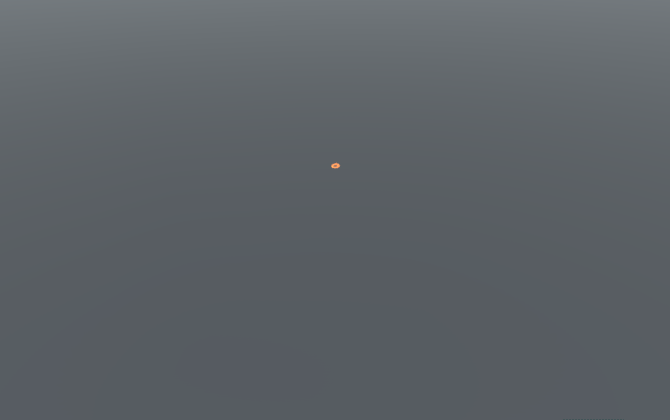

# NoiseRings

*NoiseRings* is a noisy emanating ring effect for Unity adapted with permission from the VR music video experience [Chorus]. Tested with Unity 2018.3.0f2.

## Usage

An example is provided in `Assets/Example/ExampleScene.unity`. Attach a `NoiseRingSource` component to the GameObject you would like the noise rings to emanate from. For the `NoiseRingSource` to render correctly the `UpdateShaderGlobals` component must be attached to a GameObject in the scene. The noise ring animation can be triggered by calling `Trigger()` on the `NoiseRingSource`.

## Settings

 Name | Type | Description
:---- |:---- |:-----------
Number Of Segments | `int` | Number of segments in the generated ring mesh. Increase this value if the rings appear too jagged.
Number Of Rings | `int` | Number of rings to emanate when the animation is triggered.
Radial Offset | `float` | Radial distance between the rings when emanated. This allows you to control how far apart the rings appear to be spaced. Note that the distance will shrink as the animation progresses and the rings will converge at the end.
Line Texture | `Texture2D` | Texture to use for rendering the ring lines. The texture will be stretched horizontally around the circumference of the ring.
Color | `Color` | Line color.
Multiplier | `float` | Line color multiplier.
Line Width | `float` | Line width. This is scaled with the transform's z scale value.
Noise Scale | `float` | Scale of the noise applied to the rings. Higher is bumpier, lower is smoother.
Noise Height | `float` | How much the noise affects the height of the rings.
Detail Noise Scale | `float` | Scale of the detail noise applied to the rings. Higher is bumpier, lower is smoother.
Detail Noise Height | `float` | How much the detail noise affects the height of the rings.
Speed | `float` | Speed at which the noise changes.

## Animation Settings

 Name | Type | Description
:---- |:---- |:-----------
Animation Duration | `float` | Total duration in seconds for the animation to complete after being triggered.
End Radius | `float` | The final radius the rings will reach and converge at.
Intensity Curve | `AnimationCurve` | Curve that determines how much the noise affects the rings as they progress outward.
Max Height | `float` | Maximum height above the ground the rings will reach.
Height Curve | `AnimationCurve` | Curve that determines the height of the rings relative to the max height as they progress outward.

## Public Methods
 
 Name | Return Type | Description
:---- |:----------- |:-----------
`Trigger()` | `void` | Triggers the animation.
`EndAnimation()` | `void` | Ends the animation early.
`AnimationDuration()` | `float` | Returns the animation duration.

[Chorus]: http://tylerhurd.com/projects/chorus/